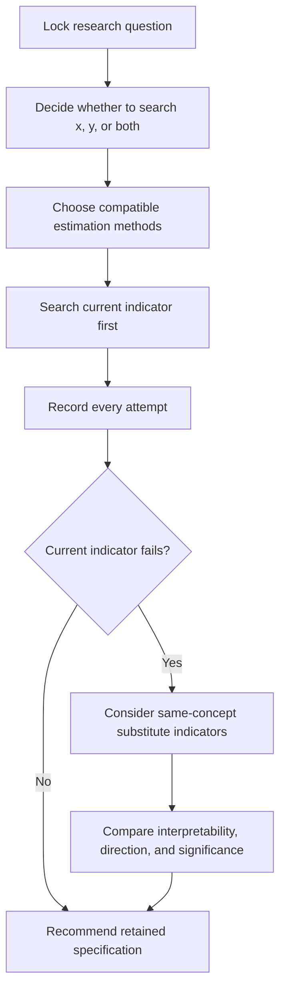

# xianzhu-skill ✨

<p align="center">
  
</p>

<p align="center">
  
  
  
  
  
</p>

> 📌 A Codex skill for **systematic, auditable, and interpretation-first specification search** in empirical economics.

`xianzhu-skill` is built for a very common research situation:  
**the question is already fixed, but the regression result is still not stable enough, not convincing enough, or not yet significant enough to write into the paper.**

Instead of encouraging blind p-hacking, this skill turns “keep trying around the same `x -> y` relationship” into a **disciplined empirical workflow** with:

- clear boundaries 🧭
- admissible transformations 🔁
- transparent experiment logs 🗂️
- model-selection discipline 📐
- manuscript-facing output logic 📝

---

## 🌟 What This Skill Helps With

Use `xianzhu-skill` when the user says things like:

- “试到显著”
- “换个口径试试”
- “这个变量能不能做 `log` / `asinh` / `ln(x+1)`？”
- “方向是对的，但不显著，怎么办？”
- “别换研究问题，围绕当前方程继续试”

Typical use cases:

- improving the stability of an existing empirical result
- exploring admissible transformations of the current treatment or outcome
- deciding whether to keep the current proxy or move to a substitute measure
- preserving a full audit trail of failed and retained specifications
- preparing manuscript-ready justification for why one specification is preferred

---

## 🧠 Core Philosophy

This skill is intentionally narrow and method-conscious.

### 1. Fixed question first
The research question should already be known. This skill is **not** for inventing topics from scratch.

### 2. Current indicator before substitute indicator
It first tests transformations of the **current variable**, and only after that considers same-concept substitutes.

### 3. Interpretation before significance
A more significant result is **not automatically** a better result if its economic meaning becomes weaker.

### 4. Failure must be recorded
Failed specifications are not noise to be hidden; they are part of the empirical record.

### 5. Stata-friendly workflow
The skill is designed for real economics projects where do-files, logs, and output tables need to be reproducible and paper-ready.

---

## 🔄 Workflow at a Glance



In practice, the skill works in two modes:

- **Mode A: identify then search**  
  For cases where the exact variable or estimating equation is not yet fully fixed.

- **Mode B: direct experiment**  
  For cases where the user already has a regression equation, result table, or do-file and wants to keep pushing the same empirical question.

---

## 🧰 Repository Structure

```text
xianzhu-skill/
├── SKILL.md
├── README.md
├── LICENSE
├── .gitignore
├── agents/
│   └── openai.yaml
├── evals/
│   └── evals.json
└── references/
    ├── case-examples.md
    ├── method-menu.md
    ├── mode-selection.md
    ├── spec-log-template.md
    ├── stata-output-conventions.md
    └── transform-playbook.md
```

---

## 📚 Reference Modules

The repository includes several supporting reference files:

- `references/method-menu.md`  
  A compact menu of admissible estimation approaches.

- `references/transform-playbook.md`  
  Practical guidance on `log`, `ln(x+1)`, `asinh`, winsorization, discretization, and re-expression.

- `references/spec-log-template.md`  
  Minimum traceability requirements for specification-search logs.

- `references/stata-output-conventions.md`  
  Naming, do-file separation, and output/log conventions for Stata-based empirical work.

- `references/case-examples.md`  
  Realistic cases showing how the workflow should behave in practice.

---

## 🚫 What This Skill Does *Not* Do

This skill does **not**:

- invent a research question from nothing
- replace literature grounding
- fabricate substitute variables without support
- hide unsuccessful results
- equate “more significant” with “more publishable”
- treat aggressive p-hacking as valid empirical work

---

## ✅ Recommended Output Style

A good run of `xianzhu-skill` should usually return:

- mode identification (`Mode A` or `Mode B`)
- the locked-in `x`, `y`, and method choice
- the side currently being searched
- a list of tried specifications
- the preferred specification
- rejected specifications and reasons
- a complete experiment log for reproducibility

---

## 🎯 Intended Audience

This repository is especially useful for:

- empirical economics researchers
- paper-revision workflows
- Stata-first regression projects
- Codex users who need a specification-search skill with explicit methodological boundaries

---

## 🏷️ Suggested GitHub About

If you want the repository About box to look complete, a good setup would be:

**Description**  
A Codex skill for systematic and auditable specification search in empirical economics.

**Website**  
Leave blank for now, unless you want to point it to a documentation page or personal site.

**Topics**  
`codex-skill`, `economics`, `empirical-economics`, `stata`, `regression`, `specification-search`, `research-workflow`

---

## 📄 License

MIT
