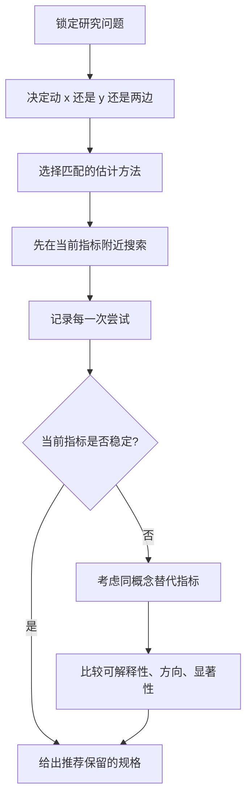

# xianzhu-skill ✨

<p align="center">
  
</p>

<p align="center">
  
  
  
  
  
</p>

> 📌 一个给 **Codex** 用的中国实证经济学家向 skill：
> **系统性、可审计、解释优先** 的规格搜索（specification search）协议。

`xianzhu-skill` 解决一个最常见的研究困境：
**研究问题已经定了，但回归结果不够稳、不够可信、或者不够显著，还没到能写进论文的程度。**

它不会鼓励盲目追求 p-value，
而是把"在同一个 `x → y` 关系附近继续试"这件事，
变成一份**有边界的、有日志的、有解释交代的工作流**：

- 边界清晰 🧭
- 容许变换可枚举 🔁
- 实验日志可追溯 🗂️
- 模型选择有纪律 📐
- 输出面向投稿 📝

---

## 🌟 本版本更新亮点（v2.0.0）

> 每发一版就把这一段换成最新的；要查历史变更看 [CHANGELOG](CHANGELOG.md)。

- **新增三段参考规范**：
  - `references/attempt-ladder.md` —— 把"显著性尝试"按层级排序，第 0 层先判断**要不要救这条结果**，避免拿不适合的规格硬撑显著性。
  - `references/stop-rules.md` —— 明确列了四类**该停下来的迹象**（极端窗口才显著 / 显著掉样本才显著 / 堆控制变量才显著但解释变差 / 控制变量主要改符号不改进精度）。
  - `references/stata-collab-template.md` —— Stata 主回归的硬性协作约定（中文可读脚本名、`DID` 统一变量名、`.rtf` 优先入正式表、`csv/dta` 只放审计目录、每轮结果配 `md` 小结）。
- **方法菜单与变换剧本同步更新**（`method-menu.md` / `transform-playbook.md` / `case-examples.md` / `stata-output-conventions.md`）：补一组与上三段规范配套的判定与示例，便于 Codex 直接复用。
- **与 [`cc-codex-collaboration-skill v2.0.0`](https://github.com/yichaoli921/cc-codex-collaboration-skill) 协同发布**：在双代理协议里跑本 skill 时，命名顺序与"正式 / 试验 / 失败"标签自动对接。

---

## 🧭 什么时候用

用户说一句以下话，本 skill 就该被加载：

- "试到显著"
- "换个口径试试"
- "这个变量能不能做 `log` / `asinh` / `ln(x+1)`？"
- "方向是对的，但不显著，怎么办？"
- "别换研究问题，围绕当前方程继续试"
- "为什么这个方程不显著"
- "调参 / 试模型 / 稳住结果"

---

## 🌟 这个 skill 解决什么

经验类论文里**研究问题已经定**，但结果还没稳定的场景，本 skill 把以下工作流落实：

- 提升已有结果的稳定性
- 在当前指标附近做合乎经济学意义的变换
- 决定保留当前代理变量，还是换同概念但更稳的代理
- 完整保留失败尝试与保留规格的审计痕迹
- 为投稿准备"为什么留这条规格"的解释

---

## 🧠 核心立场

本 skill **故意做窄**：只在你已经有明确经济学问题时才有用。

### 1. 先定问题
研究问题**已经知道**。本 skill **不**用来凭空发明题目。

### 2. 先动当前指标，再考虑同概念替代
先在**当前变量**周围做变换；若都不行，再考虑同概念的替代指标。

### 3. 解释优先于显著
更显著的系数**不等于更好的结果**——如果它让经济学解释变弱。

### 4. 失败必须留痕
失败的规格**不是要被藏起来的噪声**，而是经验记录的一部分。

### 5. Stata-friendly
面向真实经济学项目：`do` 文件、log、输出表必须可复现、可投稿。

---

## 🔄 一眼看流程


```mermaid
flowchart TD
    A[锁定研究问题] --> B[决定动 x 还是 y 还是两边]
    B --> C[选择匹配的估计方法]
    C --> D[先在当前指标附近搜索]
    D --> E[记录每一次尝试]
    E --> F{当前指标是否稳定?}
    F -- 是 --> G[给出推荐保留的规格]
    F -- 否 --> H[考虑同概念替代指标]
    H --> I[比较可解释性、方向、显著性]
    I --> G
```

实际跑起来分两种模式：

- **Mode A：先识别再搜索**  
  变量或方程还没完全定下来的场景。

- **Mode B：直接做实验**  
  用户已经有一份回归方程 / 结果表 / `do` 文件，想围绕同一问题继续试。

---

## 🧰 仓库结构

```text
xianzhu-skill/
├── SKILL.md                       ← Codex 加载的协议本体
├── README.md                      ← 本文件
├── LICENSE                        ← MIT
├── CHANGELOG.md
├── .gitignore
├── agents/
│   └── openai.yaml                ← Codex 侧子代理配置示例
├── evals/
│   └── evals.json                 ← 触发式测试用例
└── references/
    ├── attempt-ladder.md          ← (v2.0) 显著性尝试梯子
    ├── case-examples.md           ← 真实案例
    ├── method-menu.md             ← 容许的估计方法菜单
    ├── spec-log-template.md       ← 规格日志最小可追溯要求
    ├── stata-collab-template.md   ← (v2.0) Stata 协作输出规范
    ├── stata-output-conventions.md← Stata 文件 / do / 输出约定
    ├── stop-rules.md              ← (v2.0) 停机规则
    └── transform-playbook.md      ← 变换剧本（log / asinh / winsor / 离散化 ...）
```

---

## 📚 参考模块清单

仓库里以下文件供 Codex 在判定时直接读取：

- `references/attempt-ladder.md` 🆕  
  把"显著性尝试"按层级排序，从"要不要救这条结果"开始判断。

- `references/stop-rules.md` 🆕  
  列出该停下来的四种典型迹象，避免无效试跑。

- `references/stata-collab-template.md` 🆕  
  Stata 协作输出硬性约定：脚本名 / 变量名 / 输出路径 / 审计目录。

- `references/method-menu.md`  
  一份精简的"可用估计方法"清单。

- `references/transform-playbook.md`  
  `log` / `ln(x+1)` / `asinh` / winsor / 离散化 / 重表达 的实操指南。

- `references/spec-log-template.md`  
  规格搜索日志的最小可追溯要求。

- `references/stata-output-conventions.md`  
  命名、`do` 文件拆分、输出 / log 约定。

- `references/case-examples.md`  
  真实案例，展示工作流在实际项目里的样子。

---

## 🚫 这个 skill **不**做什么

本 skill **不会**：

- 凭空发明研究问题
- 替代文献综述
- 没有依据地伪造替代变量
- 隐藏不显著的结果
- 把"更显著"等同于"更可发表"
- 把激进 p-hacking 当成有效经验研究

---

## ✅ 推荐输出形态

跑完一轮 `xianzhu-skill`，通常会得到：

- 模式识别（`Mode A` 或 `Mode B`）
- 锁定的 `x` / `y` 与方法选择
- 当前在动哪一侧（x / y / 两侧）
- 试过的规格清单
- 推荐的保留规格
- 被否定的规格与其被否理由
- 完整的实验日志（可复现）

---

## 🎯 适用对象

本仓库特别适合：

- 中国实证经济学科研工作者（中文为主）
- 经验类论文修改阶段
- Stata 优先的回归项目
- 在用 Codex、需要"有边界的显著性搜索"协议的论文复现流程
- 已经装好 [`cc-codex-collaboration-skill`](https://github.com/yichaoli921/cc-codex-collaboration-skill) 的双代理用户

---

## 🏷️ 推荐 GitHub About

仓库描述：

**中文**：中国实证经济学科研向 Codex skill：把"试到显著"变成可审计、可解释、有边界的规格搜索。

**English**：A Codex skill for systematic and auditable specification search in empirical economics.

Topics：
`codex-skill` `economics` `empirical-economics` `stata` `regression` `specification-search` `research-workflow` `经验研究` `显著性`

---

## 🔗 与本系列其他 skill 的关系

| Skill | 关系 | 仓库 |
|---|---|---|
| **cc-codex-collaboration-skill** | 上游：双代理协作协议（脚手架） | https://github.com/yichaoli921/cc-codex-collaboration-skill |
| **xianzhu-skill（本仓库）** | 方法类：显著性 / 规格搜索 | https://github.com/yichaoli921/xianzhu-skill |

推荐组合：先装 `cc-codex-collaboration-skill` 建协作环境，再装本 skill 做方法学任务。

---

## 📄 License

MIT
